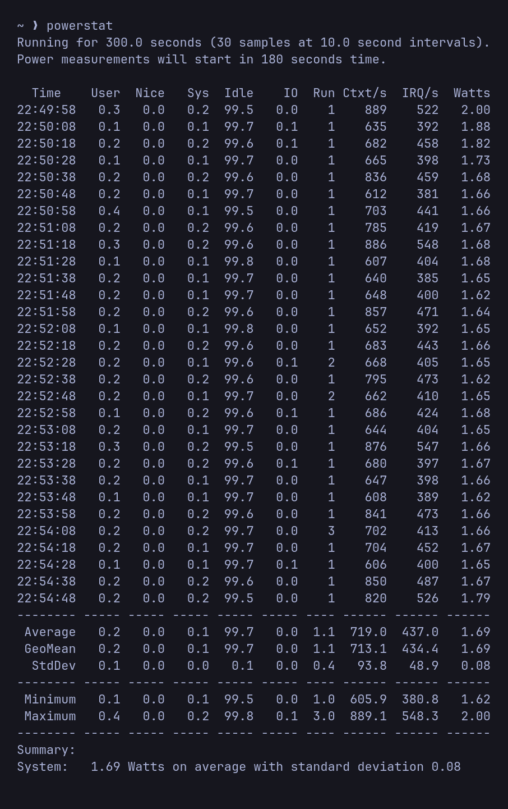

# fw12powersave

Idle-power + sleep tuning for the **Framework Laptop 12** (13th-gen Intel, e.g. i5-1334U)
on **Arch / Omarchy + Hyprland**, distilled from a long real debugging session.

Two independent things, both proven on hardware:

1. **Idle → ~1.7 W.** Turn the display fully OFF on idle. This is the big everyday battery win.
2. **Sleep → use HIBERNATE, not suspend.** On FW12, suspend (s2idle *and* deep S3) breaks the
   accelerometer/tablet-mode and resume is unstable — so this masks suspend and hibernates instead.

## Proof it works

`powerstat`, idle with screen off, on a Framework 12 (i5-1334U, Omarchy/Hyprland):



**~4 W → 1.69 W average**, at/below the GNOME/Fedora reference. Full log:
[`results/powerstat-after.txt`](results/powerstat-after.txt).

---

## ⚠️ The big FW12 gotcha: do NOT suspend (s2idle or S3)

On this machine, **suspending kills the ChromeOS-EC base accelerometer.** After resume the
base accel (Bosch `bma422`, iio label `accel-base`) reads `0,0,0`, and `cros-ec-lid-angle`
then returns the sentinel **`500`** — which breaks tablet-mode detection and auto-rotation.

- Happens on **both s2idle and deep S3**.
- It's an **EC-firmware/chip bug below the kernel**: the `cros_ec_sensorhub` resume handler only
  re-enables the FIFO interrupt and does no sensor re-init, so once the chip goes silent on
  suspend, Linux can't revive it. Confirmed dead ends: driver unbind/rebind, full module reload,
  `ectool motionsense` ODR/range/ec_rate pokes — **all fail**. **`ectool reboot_ec` does not fix
  it and can hang the machine** (15-s power-button hold). Don't.
- Only a **full re-probe — reboot or hibernate — revives it.**
- s2idle resume is also **unstable** on FW12 (spontaneous reboot-on-resume).
- Confirmed on **BIOS 03.06 and 03.07** (Framework SWFW issue
  [#222](https://github.com/FrameworkComputer/SoftwareFirmwareIssueTracker/issues/222)); no
  released kernel/firmware fix as of mid-2026.

**So the fix is: don't suspend — hibernate.** Hibernate does a full re-probe on resume (revives
the accel), draws zero power, and avoids the unstable s2idle path.

---

## What `install.sh` does

1. **Idle (the power win):** hypridle locks + turns the **display off** at `SCREENOFF_SEC` (90 s).
   With the screen on, the compositor pins the SoC package in shallow PC2/PC3 (~2.95 W);
   screen-off lets it reach PC6/PC8 (~1.8 W) and powers down the backlight.
2. **Away → hibernate:** at `AWAY_SEC` (10 min) idle **and on lid close** (logind), the machine
   hibernates — *if* the system is hibernate-ready (swap ≥ RAM + `resume=` on cmdline; Omarchy
   sets this up by default).
3. **Masks `suspend.target` + `suspend-then-hibernate.target`** so the buggy suspend path can't
   fire (from the menu, scripts, or anything else).
4. Does **NOT** force S3 and does **NOT** install accelerometer resume hacks — both were tried
   and don't work.

If the system isn't hibernate-ready, install.sh keeps the screen-off idle win, skips the
hibernate/mask steps, and tells you how to enable hibernation (or just shut down when away).

---

## The findings (why these, and what *doesn't* work)

- **Idle power is screen-off + brightness, not CPU C-states.** This CPU only exposes
  `C1/C2/C3_ACPI` (no native C6/C8/C10) — and **stock Fedora on the same silicon is identical**,
  so it's normal, not a bug. Don't chase `intel_idle`, `mem_sleep`, kernel swaps, or
  `pcie_aspm` — none of them moved idle power. Screen-off did (−1.1 W package) + backlight.
- **S3 deep sleep is NOT worth enabling.** It gives better *suspend* power than s2idle, but on
  FW12 it (and s2idle) breaks the accelerometer, so suspend is off the table entirely — hibernate
  replaces it.

---

## Requirements

- Framework Laptop 12 (or similar 13th-gen Intel ChromeOS-EC convertible).
- Hyprland + `hypridle`; systemd; `sudo`.
- For hibernate: swap ≥ RAM and `resume=`/`resume_offset=` on the kernel cmdline + the `resume`
  mkinitcpio hook (Omarchy default). Check: `cat /sys/power/state` contains `disk`.
- Best on Omarchy (uses `omarchy-system-lock`); falls back to `loginctl lock-session`.

## Install

```bash
git clone https://github.com/mechanicsunlocked/fw12powersave.git
cd fw12powersave
./install.sh
```

Tune via env:
```bash
SCREENOFF_SEC=120 AWAY_SEC=900 ./install.sh   # screen-off / hibernate timeouts (seconds)
NO_HIBERNATE=1 ./install.sh                    # screen-off idle only; don't mask suspend or hibernate
```

⚠️ **Test `systemctl hibernate` resumes cleanly once** before trusting auto-hibernate.

## What gets changed

| Path | Change |
|---|---|
| `~/.config/hypr/hypridle.conf` | replaced (timestamped backup kept): lock+screen-off, hibernate when away |
| `/etc/systemd/logind.conf.d/fw12-lid-hibernate.conf` | created → lid close hibernates |
| `suspend.target`, `suspend-then-hibernate.target` | **masked** (suspend disabled) |

## Verify

```bash
cat /sys/power/mem_sleep                        # informational
systemctl is-enabled suspend.target             # -> masked
# after a hibernate + resume, tablet sensors must be alive:
for d in /sys/bus/iio/devices/iio:device*; do [ "$(cat $d/label 2>/dev/null)" = accel-base ] \
  && echo "base accel: $(cat $d/in_accel_x_raw),$(cat $d/in_accel_y_raw),$(cat $d/in_accel_z_raw)"; done
```

`probe.sh` dumps cpuidle states, package C-states, S0ix, RAPL and battery draw for comparison.

## Uninstall

```bash
./uninstall.sh   # unmasks suspend, removes the lid drop-in, restores hypridle
```

## BIOS / firmware

Check with `fwupdmgr get-updates`. As of mid-2026 the latest FW12 BIOS is **03.07** and there's a
**UEFI dbx** security update — both worth applying (`sudo fwupdmgr update`), but note **03.07 does
NOT fix the suspend/accelerometer bug**.

## License

MIT. No warranty — you're changing power/suspend behaviour on your own hardware.
